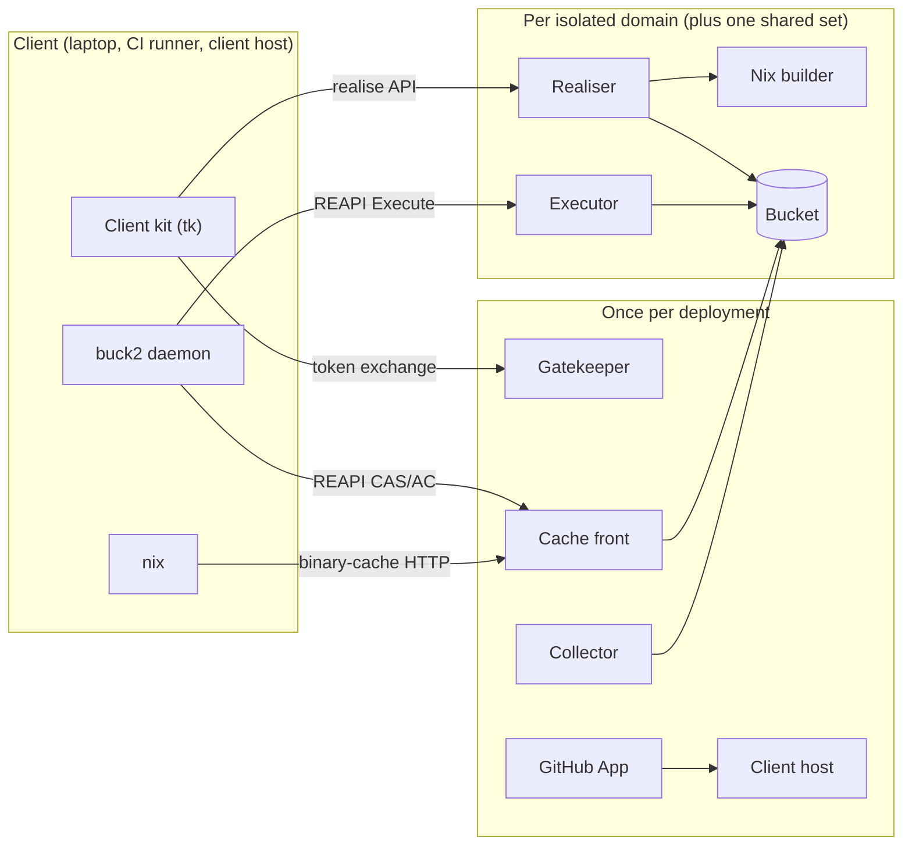

# Spec: the build service

- **Status:** being charted. Sections are added as the map's tickets resolve; a missing section is still an open ticket.
- **Charted by:** the wayfinder map [Incremental builds everywhere for turnkey repos on GitHub](https://github.com/firefly-engineering/turnkey/issues/60). Each section cites the ticket that holds the full decision.
- **Vocabulary:** [`CONTEXT.md`](../../CONTEXT.md).

## Goal

Incremental builds actually running for turnkey repos on GitHub. The **build service** turnkey ships as a product: building blocks that any turnkey-managed repo on GitHub assembles to get incremental builds and tests on every machine (CI, laptops) without trusting PRs or developer machines. The backend is one service with two faces over shared storage, REAPI (content store, action cache, Execute with a Nix-programmable base image) and a Nix binary cache, deployed on Cloud Run and scaling to zero.

## Trust rule

*Sources: [ADR 0016](../adr/0016-clients-never-write-results-that-anyone-else-reads.md) and [ADR 0017](../adr/0017-consumers-map-builds-to-trust-domains.md).*

**Clients never write results that anyone else reads.** Clients upload hash-verified blobs and submit derivations; results others read come only from the executor and the Nix builder. A client may write only into a bubble its own domain reads. Results are partitioned into trust domains: see "Sandbox-escape risk and trust domains".

## Client: local execution hygiene

*Source: [Should tk own the buck2 daemon's environment?](https://github.com/firefly-engineering/turnkey/issues/68).*

**Any action can run in either place.** An action, Linux or darwin, can run locally or remotely wherever a compatible environment exists, as the same action with the same key. Byte-identical outputs are a goal, checked by [Verify action keys match across machines (G10)](https://github.com/firefly-engineering/turnkey/issues/55), not a guarantee: a divergent output costs downstream cache misses, never a wrong result. So a local action sees no environment except what it declares, exactly like a remote one. This holds even though local results are never shared: a leaked variable outside the key also makes the local daemon reuse outputs built under an older shell.

| Rule | Behaviour |
|---|---|
| **tk owns the daemon environment** | `tk` builds the environment buck2 runs with; it never forwards the dev shell's. |
| **Strict allowlist** | `HOME` and `TMPDIR` pinned to fixed per-repo locations, `LANG=C.UTF-8`, `TZ=UTC`, an empty or store-path-only `PATH`, and buck2's own `BUCK_*`/`BUCK2_*` settings. Nothing else. |
| **Tools declare what they need** | A variable a tool needs (`SDKROOT`, `MACOSX_DEPLOYMENT_TARGET`, …) is declared action env set by its toolchain, never inherited. Nix's `cc-wrapper` reading `NIX_CFLAGS_COMPILE`/`NIX_LDFLAGS` is the case that makes this necessary even with store-path toolchains. |
| **darwin SDK is a store path** | The macOS SDK comes from Nix (`apple-sdk`) and is declared as action env and inputs, so a future remote darwin executor sees the same action. The system Xcode SDK is never referenced. |
| **No secrets in the environment** | buck2 reads `$VAR` in `http_headers` from the daemon's environment, which would expose the token to every local action and pin it until a restart. The build service's credential is a client certificate file (`tls_client_cert`), which buck2 re-reads and Nix also accepts. |
| **Fingerprint and restart** | `tk` writes a fingerprint of the environment it built into the isolation directory. On any mismatch, including a missing fingerprint (a daemon started some other way), it kills and restarts the daemon, the path stale cells already take. |
| **Plain `buck2` goes through tk** | The dev shell shadows `buck2` with a wrapper that uses `tk`'s environment builder, so editors and scripts get the same daemon. The fingerprint is the safety net for anything that bypasses it. |
| **`tk run` keeps the user's environment** | The program `buck2 run` starts is the user's, not an action: buck2 execs it from the client process with the client's environment (`app/buck2_client/src/commands/run.rs` at the pinned revision, `envp: std::env::vars()`). Since `tk` runs the client with the scrubbed environment, `tk run` asks buck2 for the command (`--command-args-file`) and execs it itself with the user's environment. |
| **Unaffected** | `tk sync` runs in `tk`'s own process before buck2; the FUSE composition daemon is a separate process. Tests run in the daemon and get the scrubbed environment, as intended: a test that needs a variable declares it. |

**Ordering.** An empty `PATH` breaks every rule that finds `sh`, `python3` or a compiler on `PATH`, which is also exactly what breaks remote execution. Scrubbing lands after [Rust toolchain: give buck2 a store-path rustc instead of PATH (G1)](https://github.com/firefly-engineering/turnkey/issues/46), [Go toolchain: make GOROOT a keyed input instead of PATH (G2)](https://github.com/firefly-engineering/turnkey/issues/47) and [Turnkey-owned execution platform replacing prelude//platforms:default (G5)](https://github.com/firefly-engineering/turnkey/issues/50). Execution: [tk starts the buck2 daemon with a minimal pinned environment (G4)](https://github.com/firefly-engineering/turnkey/issues/49).

## Executor contract

*Source: [What does the executor need from an action to run it?](https://github.com/firefly-engineering/turnkey/issues/70). Key rule: [ADR 0014](../adr/0014-the-build-environment-stays-out-of-action-keys.md).*

**The Nix environment is transparent to buck2.** buck2 never asks Nix for anything and never knows it is there: whatever an action needs is already at the path it expects, on a laptop because the dev shell built it, on the executor because the service instantiated the **build environment** before running the action. This is why the REAPI and the Nix cache are one service: the environment an action runs in is provisioned from the same service's cache, cheaply, before any action starts.

| Rule | Behaviour |
|---|---|
| **Build environment** | A dedicated output of the repo's flake, generated by turnkey's flake module: the toolchains cell, the deps cells and the prelude, so everything buck2 actions can reach. Not the dev shell, which also carries editors and linters no action uses. |
| **Client evaluates** | The client evaluates the flake and submits the build environment's derivation closure through the realise API ([How can a client ask a remote service to build a derivation?](https://github.com/firefly-engineering/turnkey/issues/65)); the service answers with an **environment id**. This works alike for laptops with uncommitted changes, CI runners and the service-owned client host. Derivations are work, not results, so the trust rule holds. |
| **Session before buck2** | Before invoking buck2, `tk` has the service realise the build environment (one narinfo lookup per root when cached) and gets its id. A missing store path is the service's problem at session start, not a failed action. |
| **Environment id rides as a header** | `tk` writes the id into buck2's RE `http_headers`. It is not a platform property and not in any action key. When the environment changes, the daemon-environment fingerprint ([Client: local execution hygiene](#client-local-execution-hygiene)) restarts the daemon, so the header is never stale. |
| **Keys see store paths, not the environment** | An action reaches each tool through a reference its key covers: an absolute store path in argv, a declared `PATH` value, or a store link in its inputs. A store path stands for its binary and its whole closure, so a toolchain change re-keys only the actions that use it. An action that reaches a tool through an undeclared `PATH` has a dishonest key; [Verify action keys match across machines (G10)](https://github.com/firefly-engineering/turnkey/issues/55) is where that surfaces. |
| **Platform properties** | `turnkey-os` and `turnkey-arch` only, true facts the service routes on. No environment salt, no executor image version, no epoch. The properties are the same whether or not remote execution or a cache is configured, so turning the service on re-keys nothing. |
| **Sandbox sees the whole environment** | The action sees the build environment's closure read-only at `/nix/store`, as it sees the whole store locally, so one action behaves the same in both places. The executor does not discover store paths per action. |
| **Instance cache** | An executor instance that sees an environment id for the first time fetches its whole closure from the Nix cache onto ephemeral disk and keeps it for later actions. An unknown or unrealised id fails the action with a precondition error. |
| **Action environment** | The `Command`'s env, plus a fresh per-action `HOME` and `TMPDIR`, `LANG=C.UTF-8` and `TZ=UTC`; no `PATH` unless declared. The working directory is the input root. No network. |
| **One size** | One instance size, no sizing property (a property would enter every key). The 60-minute cap already sends oversized actions local. |

**Placement.** Remote is the default. `local_only` covers darwin actions (until a darwin executor exists), actions that may run past Cloud Run's 60-minute request cap, actions that need the network, actions that create namespaces themselves (bubblewrap, nested Nix builds, containers in tests: Cloud Run sandboxes are gVisor and refuse them, per [Do Cloud Run sandboxes isolate successive actions, and does the Nix sandbox run on Cloud Run?](https://github.com/firefly-engineering/turnkey/issues/76)), and anything a rule or target marks so. Racing local against remote is off. Fallback to local happens only on infrastructure errors (the service unreachable or timing out), never on an action failure, which would hide a contract violation. An action killed for exhausting the instance's memory or disk is an action failure, not an infrastructure error, although `sandbox do` reports it like one (exit 128, `WaitPID ... EOF`): the executor must classify it, or the client would rerun it locally.

**Supersedes** the per-action store-path discovery and the client's submit-and-retry from [How do remote-execution workers get Nix store paths on demand?](https://github.com/firefly-engineering/turnkey/issues/63); its signature-checking fetcher, per-instance cache and non-root sandbox uid still stand.

## Sandbox-escape risk and trust domains

*Source: [Do we accept the sandbox-escape risk of sharing untrusted-built outputs?](https://github.com/firefly-engineering/turnkey/issues/75), revised when [What gates a merge, and what runs after landing?](https://github.com/firefly-engineering/turnkey/issues/71) was ruled out of scope. Decision record: [ADR 0017](../adr/0017-consumers-map-builds-to-trust-domains.md).*

**The risk.** Untrusted code runs on the service: actions under gVisor, one sandbox each; Nix builds in the stock Nix sandbox inside a Cloud Run microVM ([Do Cloud Run sandboxes isolate successive actions, and does the Nix sandbox run on Cloud Run?](https://github.com/firefly-engineering/turnkey/issues/76)). Whoever escapes either one controls an instance that serves later requests, and can have the service sign, or record in the action cache, a wrong output under a key someone else will look up. Nothing checks an input-addressed output or an action result against its content. So results are partitioned, and an escape's output can only travel as far as the partition lets it.

**Mechanism, not policy.** The service never decides what is trusted, and can't enforce a consumer's CI or merge rules. It provides trust domains, stacks and isolation, and attaches each build to a domain from claims it verifies itself (OIDC, App events, device-flow identity). The consumer's policy says which builds form which domain, what each domain stacks on, and which domains are isolated (how a policy is expressed: [How does a consumer map builds to trust domains?](https://github.com/firefly-engineering/turnkey/issues/252)).

| Rule | Behaviour |
|---|---|
| **Trust domain** | A set of builds, chosen by the consumer's policy, that write the same **bubble**. Both the action cache and the Nix cache are partitioned this way. |
| **Stack** | A build reads its domain's bubble, then the bubbles its domain's policy stacks it on, top-down; it writes only into its own bubble. |
| **Isolated domain** | A domain the policy marks isolated runs on Cloud Run services, with their own identities, that never run another domain's builds, and keeps its bubble in its own bucket. Only isolated domains are integrity boundaries: non-isolated domains share machinery, so an escape in one can reach the others' bubbles. |
| **Mappings are layered, content is pooled** | Escapes poison mappings, not content: action-cache entries and narinfo for input-addressed paths are kept per bubble (a prefix or managed folder). Content-store blobs and NARs are verified by hash on every read, so each isolated domain keeps one pool, and the non-isolated domains share one. |
| **Nothing moves between bubbles** | Results never move from one bubble to another; a bubble is discarded at the end of its life. The one exception: a fixed-output derivation's output, whose content hash the signer recomputes before signing, is shared by every domain, whoever requested it. |
| **Clients write only what nobody else reads** | Clients never write results that anyone else reads. A client may write into a bubble read only by its owner's domain. |
| **Mitigations** | The signing key stays off the builder ([How can a client ask a remote service to build a derivation?](https://github.com/firefly-engineering/turnkey/issues/65)); `sandbox = true`, `sandbox-fallback = false`; the builder's identity can't write the cache (fixed-output derivations reach the network and metadata server); no `ca-derivations`; every build records who requested it, so outputs can be evicted after an advisory; Nix and gVisor are patched promptly. Instances are reused within an isolation boundary: no fresh VM per build. |

**Default policy.** turnkey ships one: an isolated **mainline domain** for merge-queue runs and pushes to protected branches, at the bottom of every stack; a **PR bubble** per PR and a **developer bubble** per developer above it (see "Result sharing"). Under it, PRs reuse everything the mainline domain holds; what is lost is the mainline reusing what a PR built, so landing code is built once more in the merge queue (or on the protected branch), which is what a post-merge CI run costs today.

## Result sharing

*Source: [Which results are shared, and where do client-computed results go?](https://github.com/firefly-engineering/turnkey/issues/69). The bubbles below are turnkey's default policy; a consumer's policy may map builds differently.*

**Reading is harmless to others; only writing is policed.** Confidentiality is not a goal, so anyone who can read a repo may read any of its bubbles, and a build that reads a bad bubble hurts only itself. The client chooses its stack; the policy, applied to the build's verified claims, fixes where writes land.

| Rule | Behaviour |
|---|---|
| **PR bubble** | One per PR, keyed by repo id and PR number, fork PRs included. Holds executor results for that PR's builds. |
| **Developer bubble** | One per developer, keyed by GitHub user id. Holds executor results for builds the developer requests and their client-computed results. A push to a branch with no open PR builds in the pusher's developer bubble. There are no branch bubbles. |
| **Stack chosen by the client** | The client names its stack at session start; the service only checks that it may read the repo. `tk`'s defaults: CI on a PR reads its PR bubble, then the bubbles of the PRs it is stacked on (base branch is another PR's head, recursively), then the mainline domain. A laptop reads its developer bubble, then the PR bubble of the checked-out branch if any, then the mainline domain. |
| **Write layer fixed by the policy** | The executor writes into the bubble of the requester's domain: the PR bubble for a PR build (OIDC claims, or the client host's own trigger), the developer bubble for a developer's build (device-flow token), the mainline domain for merge-queue and protected-branch builds. |
| **Client-computed results** | A client writes them only into its owner's developer bubble. CI runners never write client-computed results into a PR bubble, which reviewers and stacked PRs read. A runner's own cache (e.g. `actions/cache`) is a local cache as far as buck2 is concerned. |
| **Mixed builds** | A local output feeding a remote action is uploaded as a hash-verified blob and its digest is in the remote action's key, so the executor's result is honest for anyone with those inputs, and it lands only in the requester's bubble. Nothing client-computed leaks into results others read; no extra rule is needed. |
| **darwin before a darwin executor** | The mainline domain holds no darwin results. On a Mac laptop, darwin actions run locally and their results go into the developer bubble; Linux actions run remotely. On macOS CI runners, darwin actions run locally with no reuse from the service. |
| **Lifetime** | A PR bubble is deleted a configurable time after its PR closes or merges (default 7 days). A developer bubble evicts entries untouched for a configurable time (default 30 days). Mechanics: garbage collection, still unspecified on the map. |
| **Local test cache** | The per-user bazel-remote of [ADR 0001](../adr/0001-runner-recorded-native-test-caching.md) becomes an optional local proxy (offline, latency) in front of the service ([Tier the per-user bazel-remote in front of the shared cache (G8)](https://github.com/firefly-engineering/turnkey/issues/53)); recorded test passes go into the local cache and the owner's developer bubble. |

## Trust-domain policy

*Source: [How does a consumer map builds to trust domains?](https://github.com/firefly-engineering/turnkey/issues/252). Mechanism: "Sandbox-escape risk and trust domains".*

| Rule | Behaviour |
|---|---|
| **Lives with the service** | The policy is part of the deployment's configuration, one per repo the deployment serves. The trust root is the service and its operators, and the policy decides integrity, so it stays with them; it is never read from the repo, which a PR could edit. A repo without a policy gets turnkey's default policy. |
| **Matches verified claims only** | Rules match a fixed vocabulary the service verifies itself: repository and owner by numeric id (never by name); the event (`push`, `pull_request`, `merge_group`, `workflow_dispatch`, a developer session); `ref`, and `ref_protected` when present; the PR number (from OIDC claims, or the App event for fork PRs); the GitHub user id for developer sessions. Claims any writer can forge (`workflow`, `workflow_ref`, `job_workflow_ref`, `environment`) are not in the vocabulary. A rule on `ref=refs/heads/main` is only as strong as the consumer's push rules for `main`; the service verifies the claim's authenticity, not its meaning. |
| **Ordered rules, first match wins** | Each rule maps matching builds to a domain declared with a name, a key (fixed, per PR, or per user), a stack (the named domains below it) and an isolated flag. A build that matches no rule is refused, never defaulted. |
| **Changes never move results** | A renamed or removed domain leaves its old bubble to garbage collection. A domain that becomes isolated starts with an empty bubble: results written on shared machinery are never inherited by an isolated domain. |
| **Optional service-side fill** | A domain may opt in to being filled by the service itself: on matching App events (e.g. a push to `main`), the service's client host runs the build. Off by default; building is the consumer's CI's job, and an unrequested build costs the consumer compute. |

**Default policy.** An isolated **mainline domain** for `merge_group` events and `push` to protected refs; a domain per PR (`pull_request`, and App events for fork PRs) stacked on mainline, whose bubble is the PR bubble; a domain per user for developer sessions stacked on mainline, whose bubble is the developer bubble.

**Recommended CI setup** (documentation, not enforced): use a merge queue where the plan allows it, with CI on `merge_group` and `pull_request`; without one, also run CI on `push` to the default branch so the mainline domain is filled; protect the default branch, since mainline rules rest on it.

## Building blocks

*Source: [What are the building blocks, and where are their seams?](https://github.com/firefly-engineering/turnkey/issues/72). Reuse decision: [ADR 0018](../adr/0018-service-blocks-are-go-on-buildbarn.md).*

| Block | Responsibility | Interface |
|---|---|---|
| **Cache front** | Every read and every content upload: REAPI CAS, AC, ByteStream and Capabilities, and the Nix binary-cache HTTP protocol. Reads walk the caller's stack; uploads are hash-checked; AC writes from clients are refused except into an owner-only bubble. | REAPI cache services and Nix substituter HTTP, behind a session credential |
| **Executor** | REAPI `Execute` only (buck2's separate `engine_address`): build-environment cache per instance, one gVisor sandbox per action, results into the requester's bubble ("Executor contract"). | REAPI Execution |
| **Realiser** | The realise API: hands derivations to the builder, verifies fixed-output hashes, signs with its domain's key, writes the Nix cache, returns environment ids. | gRPC: upload closure, Realise, Watch |
| **Nix builder** | A disposable, stock, sandboxed `nix-daemon` with no identity that can write the cache; a Cloud Run job for builds over 60 minutes. | Internal, driven by the realiser |
| **Gatekeeper** | Turns a GitHub OIDC token, an App event or a device-flow login into a session credential (a client certificate naming the build's domain and stack). The only block that knows GitHub identities and applies the trust-domain policy. | Token exchange |
| **GitHub App** | Webhooks, the Checks API, fork-PR approval and service-side fill; starts the client host. | GitHub webhooks |
| **Client host** | A Cloud Run job running `tk build` for fork PRs and service-side fill. | Internal, started by the App |
| **Collector** | Garbage collection: bubble lifetimes, and blobs kept at least 12 h after buck2 last checked them. | Scheduled job |
| **Client kit** | In `tk`: opens the session (credential, build-environment realise, stack) and configures buck2 (RE addresses, headers, certificate) and Nix (substituter, `netrc`). | `tk` commands; no new client protocol |

| Rule | Behaviour |
|---|---|
| **Storage is a seam, not a block** | The blocks that touch storage do it through one internal interface with two adapters from the start: GCS, and local disk/in memory for tests and laptops. |
| **Per isolated domain** | Each isolated domain has its own bucket, executor, builder and realiser (so its own signing key); one more set serves all non-isolated domains. The cache front, gatekeeper, App, client host and collector run once per deployment: they never run untrusted code. A client trusts the signing keys of the isolated domains in its stack. |
| **No other provider seams** | Clients speak only REAPI, the Nix cache protocol, the realise API and token exchange, so the provider never reaches them. Compute (Cloud Run) and identity (GitHub) get no seam until a second adapter exists. |
| **Build vs reuse** | Executor and cache front: Buildbarn's Go libraries with our own `Execute` handler and GCS layer ([#62](https://github.com/firefly-engineering/turnkey/issues/62)). Nix cache: no niks3; Nix's own S3 store writes it, the cache front reads it ([#64](https://github.com/firefly-engineering/turnkey/issues/64)). Builder: stock `nix-daemon` behind our realise API ([#65](https://github.com/firefly-engineering/turnkey/issues/65)). Service blocks are Go in the root module; the client kit is Rust in `tk`. |
| **Scale to zero** | All compute is Cloud Run services and jobs. An idle deployment costs its stored bytes (buckets, images in Artifact Registry) plus a few cents of fixed fees: a Cloud KMS signing key per isolated domain (about USD 0.06 a month each) and a Cloud Scheduler job for the collector (free up to three). |
| **Dogfood slice** | turnkey's own repo first assembles the cache front, executor, realiser and builder, the gatekeeper (OIDC for CI, device flow for laptops), the collector, the client kit and the default policy. The GitHub App and client host come later: fork PRs, rare on turnkey, keep plain CI meanwhile, and service-side fill waits with them. |
